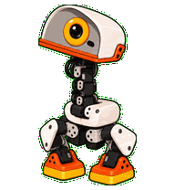
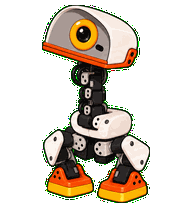
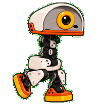
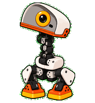
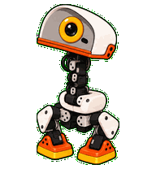

# microduck-codex-pets

An unofficial community archive of themed MicroDuck pets for Codex.

The repository starts with a cartoon `MicroDuck` pet based on the real [Pollen Robotics MicroDuck](https://github.com/pollen-robotics/microduck). More themes can be added under `pets/` without changing the install contract.

> This project is not affiliated with or endorsed by Pollen Robotics. `MicroDuck` is referenced here as the name of the open-source robot project.

## Included

### MicroDuck

- Style: compact 3D-toy cartoon
- Identity detail: thin, flat, nearly closed mechanical bill matching the physical reference
- Animation: Codex v2 atlas with standard activity states and 16 look directions
- Package: `pets/microduck/pet.json` + `pets/microduck/spritesheet.webp`

## Install locally

Copy the package into the local Codex pet directory:

```bash
PET_DIR="${CODEX_HOME:-$HOME/.codex}/pets/microduck"
mkdir -p "$PET_DIR"
cp pets/microduck/pet.json pets/microduck/spritesheet.webp "$PET_DIR/"
```

Then open Codex settings → Pets and refresh the list. The desktop app stores custom pets locally; see the [official Pets documentation](https://learn.chatgpt.com/zh-Hans/docs/pets).

## Preview

<p align="center">
  
</p>

The demo loops through idle, waddling, waving, and review so the pet's behavior is visible without opening the spritesheet.

| Idle | Waddling | Waving | Review |
| --- | --- | --- | --- |
|  |  |  |  |

- [Canonical character](previews/microduck/canonical-base-green.png)
- [Animation contact sheet](previews/microduck/contact-sheet-extended.png)
- [16 look directions](previews/microduck/look-directions.png)
- [Neutral 192×208 frame](previews/microduck/neutral-192x208.png)

## Repository layout

```text
microduck-codex-pets/
├── pets/
│   ├── catalog.json
│   └── microduck/
│       ├── pet.json
│       └── spritesheet.webp
├── previews/
├── docs/
└── NOTICE.md
```

Each future theme should get its own directory, for example `pets/microduck-space/`, with a self-contained `pet.json` and `spritesheet.webp`.

## Provenance and motion references

The cartoon character was generated with `gpt-image-2` using the real MicroDuck reference images as visual inputs. The spritesheet was assembled and validated with the Codex v2 hatch-pet workflow.

Motion grounding comes from the public [MicroDuck repository](https://github.com/pollen-robotics/microduck) and these public videos:

- [Meet Microduck, the $399 Tiny Robot You Can Teach New Tricks](https://www.youtube.com/watch?v=reiTh7K4KSc)
- [MicroDuck — Cute open-source mini duck robot](https://www.youtube.com/shorts/UV0dLksplZ0)

For future motion research, download videos locally before watching or extracting frames:

```bash
yt-dlp -f "best" --merge-output-format mp4 \
  -o "references/%(id)s.%(ext)s" \
  "https://www.youtube.com/watch?v=reiTh7K4KSc"
```

The downloaded videos and original hardware photos are intentionally not committed to this repository.

## Validation

The package was validated before publishing:

- 9 standard animation rows plus 2 look-direction rows
- RGBA WebP atlas validation
- chroma-edge despill validation
- three-reviewer blind direction validation
- independent final visual QA

The detailed QA reports are kept in the local build workspace rather than this public archive. The design decisions and reproducible prompts are in [`docs/microduck/`](docs/microduck/).

## Licensing

No license file is included yet. Until the artwork license is chosen, please do not assume that the generated artwork may be reused outside this archive. Attribution and source notes are in [`NOTICE.md`](NOTICE.md).
