# microduck-codex-pets

An unofficial community archive of themed MicroDuck pets for Codex.

The archive currently includes a cartoon `MicroDuck` pet and three themed variants, `MicroDuck Night Shift`, `MicroDuck Cloud`, and `MicroDuck Space`, based on the real [Pollen Robotics MicroDuck](https://github.com/pollen-robotics/microduck). More themes can be added under `pets/` without changing the install contract.

> This project is not affiliated with or endorsed by Pollen Robotics. `MicroDuck` is referenced here as the name of the open-source robot project.

## Meet the Flock

The current flock ships four self-contained Codex v2 pets. Each package contains a `pet.json` and a lossless RGBA spritesheet.

### MicroDuck

- Style: compact 3D-toy cartoon
- Personality: faithful, curious, and quietly mechanical
- Signature: thin, flat, nearly closed mechanical bill matching the physical reference
- Motion: Codex v2 atlas with standard activity states and 16 look directions
- Package: `pets/microduck/pet.json` + `pets/microduck/spritesheet.webp`

### MicroDuck Night Shift

- Style: flatter vector chibi cartoon
- Personality: sleepy, focused, and slightly awkward
- Signature: oversized hooded head, half-lidded camera eye, cyan status panel, and thin flat mechanical bill
- Motion: Codex v2 atlas with standard activity states and 16 look directions
- Package: `pets/microduck-nightshift/pet.json` + `pets/microduck-nightshift/spritesheet.webp`

### MicroDuck Cloud

- Style: flat vector cloud-chibi
- Personality: chubby, sleepy, and adorably awkward
- Signature: puffy cloud-integrated head and belly, single camera lens, and thin flat mechanical bill
- Motion: Codex v2 atlas with standard activity states and 16 look directions
- Package: `pets/microduck-cloud/pet.json` + `pets/microduck-cloud/spritesheet.webp`

### MicroDuck Space

- Style: flat vector astronaut chibi
- Personality: squat, curious, and adorably careful
- Signature: integrated helmet ring, puffy spacesuit, chest porthole, and thin flat mechanical bill
- Motion: Codex v2 atlas with standard activity states and 16 look directions
- Package: `pets/microduck-space/pet.json` + `pets/microduck-space/spritesheet.webp`

## Install

Choose one method to install or update the current four-pet flock:

### Install with Codex (Recommended)

Give Codex this prompt:

```text
Install or update the MicroDuck Codex pets from:

https://github.com/eriklee1895/microduck-codex-pets

Install every self-contained package under pets/ and keep unrelated pets untouched.
Tell me to refresh the Pets list when finished.
```

### Manual install

Copy the package into the local Codex pet directory:

```bash
for PET_SOURCE in pets/*; do
  [ -f "$PET_SOURCE/pet.json" ] || continue
  PET_ID="$(basename "$PET_SOURCE")"
  PET_DIR="${CODEX_HOME:-$HOME/.codex}/pets/$PET_ID"
  mkdir -p "$PET_DIR"
  cp "$PET_SOURCE/pet.json" "$PET_SOURCE/spritesheet.webp" "$PET_DIR/"
done
```

Then open Codex settings → Pets and refresh the list.

## See the Flock in Motion

Each demo loops through idle, waddling, waving, and review so the pet's behavior is visible before opening the spritesheet.

<table align="center">
  <tr>
    <td align="center" valign="top">
      <strong>MicroDuck</strong><br>
      <br>
      <sub>Original · faithful flat bill</sub>
    </td>
    <td align="center" valign="top">
      <strong>MicroDuck Night Shift</strong><br>
      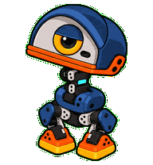<br>
      <sub>Sleepy · focused · slightly awkward</sub>
    </td>
  </tr>
  <tr>
    <td align="center" valign="top">
      <strong>MicroDuck Cloud</strong><br>
      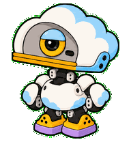<br>
      <sub>Chubby · sleepy · cloud-shaped</sub>
    </td>
    <td align="center" valign="top">
      <strong>MicroDuck Space</strong><br>
      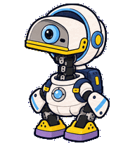<br>
      <sub>Curious · careful · astronaut</sub>
    </td>
  </tr>
</table>

### State samples

| Pet | Idle | Waddling | Waving | Review | Resources |
| --- | --- | --- | --- | --- | --- |
| `MicroDuck` |  |  |  |  | [character](previews/microduck/canonical-base-green.png) · [atlas](previews/microduck/contact-sheet-extended.png) · [directions](previews/microduck/look-directions.png) |
| `MicroDuck Night Shift` | 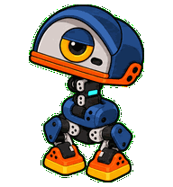 | 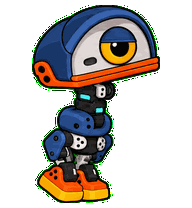 | 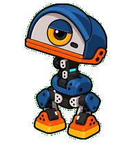 | 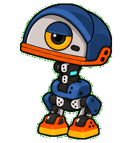 | [character](previews/microduck-nightshift/canonical-base-green.png) · [atlas](previews/microduck-nightshift/contact-sheet-extended.png) · [directions](previews/microduck-nightshift/look-directions.png) |
| `MicroDuck Cloud` | 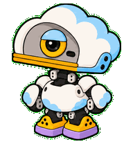 | 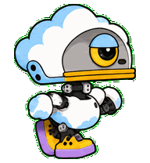 | 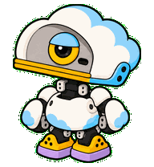 | 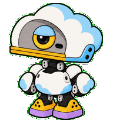 | [character](previews/microduck-cloud/canonical-base-green.png) · [atlas](previews/microduck-cloud/contact-sheet-extended.png) · [directions](previews/microduck-cloud/look-directions.png) |
| `MicroDuck Space` | 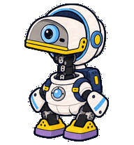 | 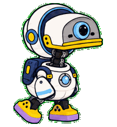 | 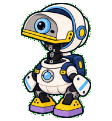 | 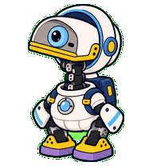 | [character](previews/microduck-space/canonical-base-green.png) · [atlas](previews/microduck-space/contact-sheet-extended.png) · [directions](previews/microduck-space/look-directions.png) |

## Repository layout

```text
microduck-codex-pets/
├── pets/
│   ├── catalog.json
│   ├── microduck/
│   │   ├── pet.json
│   │   └── spritesheet.webp
│   ├── microduck-nightshift/
│   │   ├── pet.json
│   │   └── spritesheet.webp
│   ├── microduck-cloud/
│   │   ├── pet.json
│   │   └── spritesheet.webp
│   └── microduck-space/
│       ├── pet.json
│       └── spritesheet.webp
├── previews/
├── docs/
└── NOTICE.md
```

Each future theme should get its own directory, for example `pets/microduck-garden/`, with a self-contained `pet.json` and `spritesheet.webp`.

Reusable creation prompts, mouth-design decisions, and motion mechanics are kept in [`docs/microduck/`](docs/microduck/), [`docs/microduck-cloud/`](docs/microduck-cloud/), and [`docs/microduck-space/`](docs/microduck-space/) notes. Local QA and build intermediates stay outside this public archive.

## Licensing

No license file is included yet. Until the artwork license is chosen, please do not assume that the generated artwork may be reused outside this archive. Attribution and source notes are in [`NOTICE.md`](NOTICE.md).
